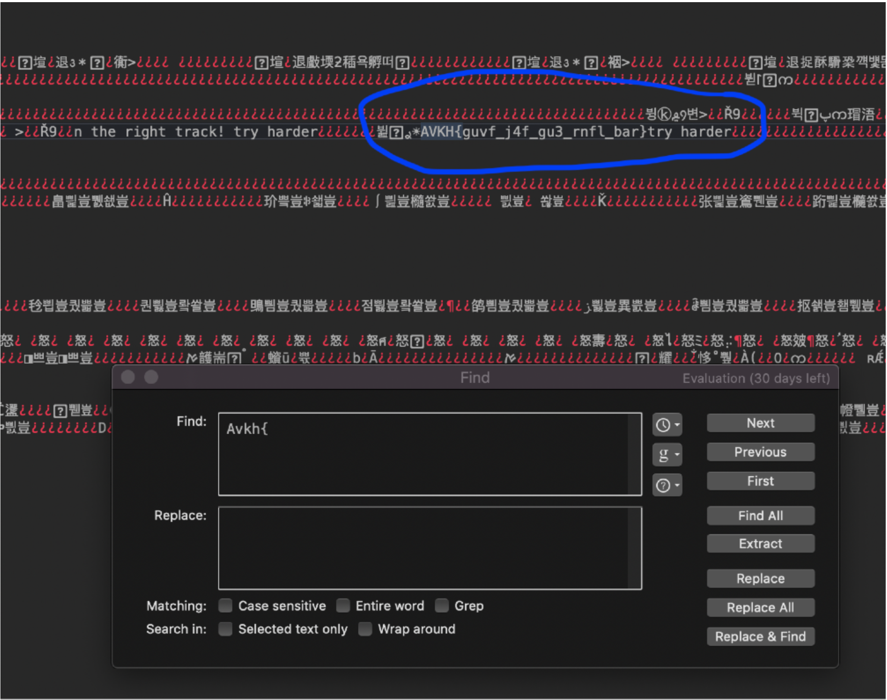
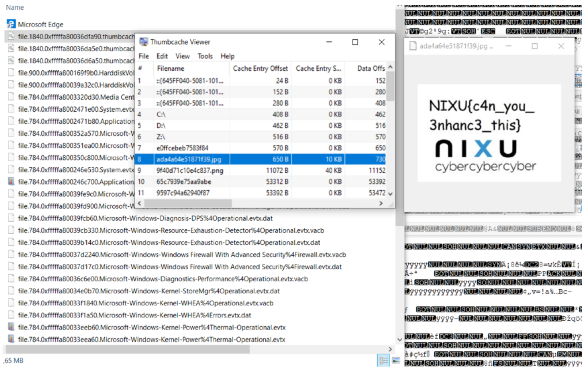
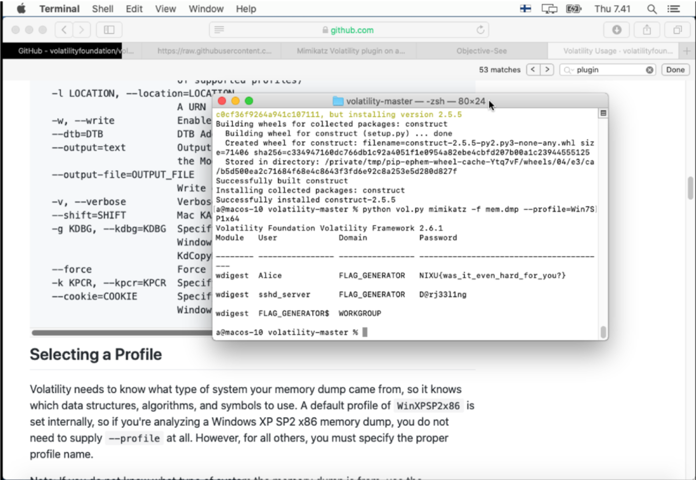

# Memory-Forensics-Nixu-Challenge
Tried out a little memory forensics, flags for Bad Memories parts 1, 3 and 5. I used the Volatility framework to investigate the memory dump provided. 

## 1. Recovering Documentation
By listing all the processes that were running at the time of the memory dump (with pslist/ psscan/pstree commands in Volatility) it can be seen that the user was running notepad.exe. It is then easy to use the command memdump -p 700, which dumps the memory of the process with the right pid into a dmp file.

I then searched for text inside this .dmp with BBEdit (I realised I should switch on the right encoding half way in), almost giving up after not finding anything with any regexp I could think of. The following day, when browsing results of another CTF, it occurred to me to try (harder) searching for strings encoded as ROT13: “Avkh{“. The flag is NIXU{this_w4s_th3_easy_one}.

  
## 3. Recovering the design
Windows stores a cache of file thumbnails used e.g. in the preview function in File Explorer. The files are called thumbcache_xxx.db. I resorted to simply dumping all files from the memory with the command dumpfiles and found the thumbcache file with a simple search. Opening the file was easy with a little Windows application called Thumbcache Viewer - I thought this would give a nice overview to files that had been present in the system, but was actually able to read the flag from right there.

I assume that the actual file would have been recoverable as well, but the 256px wide thumbnail was more than enough to give away the flag: NIXU{c4n_you_3nhanc3_this}.

## 5. Extracting user passwords

The lsass.exe process can be exploited to gain access to the passwords of users. I managed to dump these hashes with the hashdump command, with SYSTEM and SAM hive addresses as parameters. Volatility documentation then suggests cracking these hashes, but I assumed that a >20 character hash is not worth a try - although it would be interesting to know how much time it would take if one would rent an instance with a huge amount of GPUs from Amazon or another cloud computing provider.

Mimikatz is a tool able to extract plaintext passwords instead of hashes - it was made famous at the very least by being a major component of the NotPetya attacks (along with EternalBlue). It made the job very easy - even having a plugin for Volatility. I simply installed it and ran it on the memory dump and found the flag right there: NIXU{was_it_even_hard_for_you?}.

 
